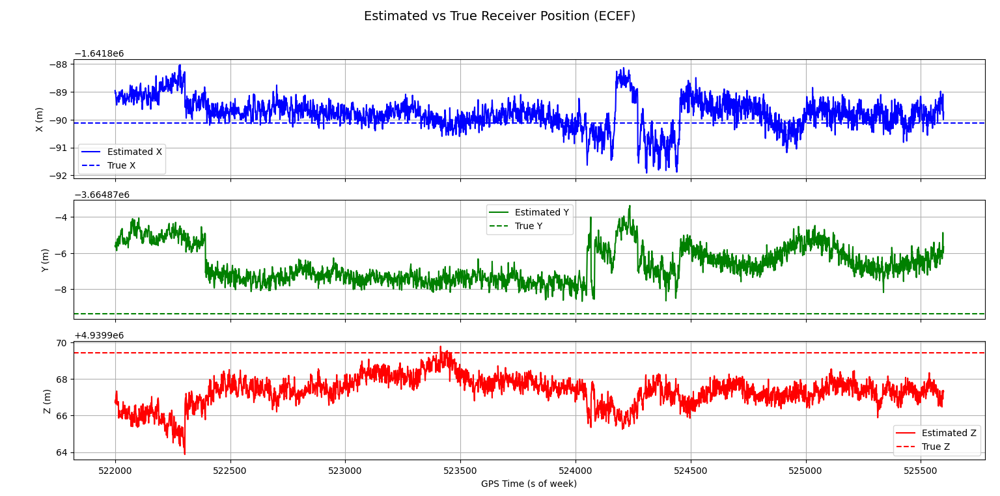
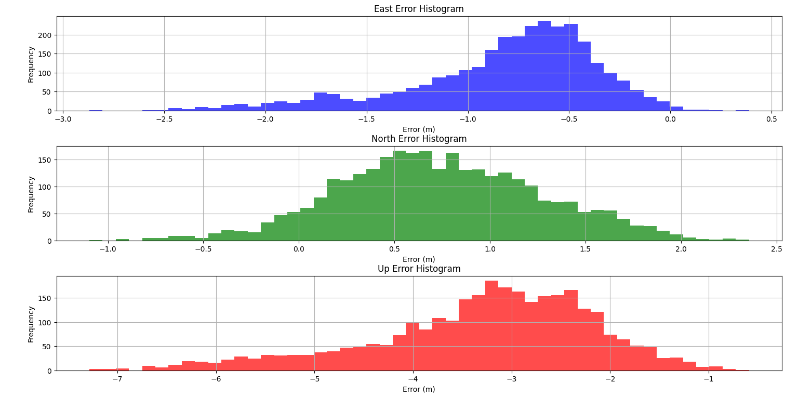

# 📡 Static Single Point Positioning (SPP) using GNSS Data

This repository contains an **implementation of Static Single Point Positioning (SPP) using GPS pseudoranges**.  
It was originally developed for **Lab 1 – ENGO 465** at the **University of Calgary**, focusing on **least-squares estimation** for GNSS positioning.

---

## 📂 Data Files Used

### ✅ `satpos.txt`
- Contains **satellite coordinates (`xᵢˢ, yᵢˢ, zᵢˢ`)** and **pseudorange corrections**.
- Used to correct measured pseudoranges.

### ✅ RINEX `.22o` file
- Contains **pseudorange observations** (e.g., C1 code) from a standalone GPS receiver.
- Parsed using the provided RINEX reader.

### ✅ `pillar_true_pos.xlsx`
- Contains the **true position of the GPS receiver** for accuracy assessment.
- Used to compare the estimated results and compute position error.

---

## 🧠 Lab Methodology

This project implements a **7-step static positioning process** using **least-squares estimation**:

1. Parse RINEX observation file to extract pseudorange data.
2. Read satellite positions and pseudorange corrections from `satpos.txt`.
3. Initialize receiver position and clock bias.
4. Compute the **design matrix (A)** and **misclosure vector (w)**.
5. Solve for corrections using **Least Squares**:  
   `d𝑟̂ = −(AᵀPA)⁻¹AᵀPw`
6. Iterate until convergence (`|d𝑟̂| < 1e-5`).
7. Output final position and compare with true value.

---

## ⚙️ How to Build and Run the Code

### 🔸 On Windows (Recommended: CMake + MinGW or Visual Studio)

#### ✅ Build with MinGW

```sh
# Open PowerShell or CMD
cd path\to\project

# Create and enter build directory
mkdir build
cd build

# Generate build files
cmake .. -G "MinGW Makefiles"

# Build
mingw32-make

# Run
StaticSPP.exe (CMD)
.\StaticSPP.exe (Power Shell)

---
## 📊 Results Overview

This implementation estimates receiver position and analyzes accuracy using pseudorange data.

### 🟢 Final Estimated Position vs True Position (ECEF)
  
This figure compares the estimated receiver coordinates at each epoch with the known true position in ECEF coordinates.

---

### 🟦 Position Error Histograms
  
Histograms of East, North, and Up position errors. The errors are generally centered and reveal higher variation in the Up direction, consistent with standalone GPS limitations.

---

> 📌 For more results like clock bias, DOP values, and uncertainty analysis, refer to the full report or explore the `result/` folder.
